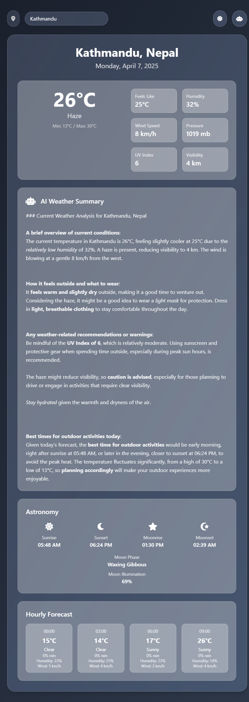

# Weather App

A sleek and modern weather application built with HTML, Tailwind CSS, and JavaScript. This app provides real-time weather data, an AI-generated summary, and a responsive design with light/dark mode support.

## Features

- **Real-Time Weather Data**: Fetches current weather conditions, hourly forecasts, and astronomy details using the [wttr.in](https://wttr.in) API.
- **Location Detection**: Uses geolocation or IP-based fallback (via [ipify.org](https://api.ipify.org) and [ipinfo.io](https://ipinfo.io)) to determine the user's city.
- **AI Weather Summary**: Generates a conversational weather analysis with Markdown formatting using the DeepInfra API.
- **Responsive Design**: Built with Tailwind CSS, featuring a glassmorphism UI and smooth animations via Animate.css.
- **Dark/Light Mode**: Toggle between themes with local storage persistence.

## Demo

(Insert a link to a live demo here if you host it, e.g., GitHub Pages or another service.)

## Screenshots


## Installation

1. Clone the repository:
   ```bash
   git clone https://github.com/notsopreety/weather-app.git
   ```
2. Open `index.html` in a web browser. No additional setup is required as it uses CDN-hosted libraries.

3. Run the file using python command line _(*OPTIONAL)_
    ```bash
    python -m http.server 3000 
    ```

## Usage

- **Location**: Allow geolocation for precise data or let it fall back to IP-based city detection.
- **Search**: Type a city name in the search bar to get weather details.
- **AI Summary**: Click the robot icon for a detailed, Markdown-formatted weather analysis.
- **Theme**: Toggle between light and dark modes using the moon/sun icon.

## Technologies Used

- **HTML**: Structure and content.
- **Tailwind CSS**: Styling and responsive design.
- **JavaScript**: Logic, API calls, and dynamic updates.
- **External APIs**:
  - [wttr.in](https://wttr.in) for weather data.
  - [ipify.org](https://api.ipify.org) and [ipinfo.io](https://ipinfo.io) for IP-based location.
  - [DeepInfra](https://deepinfra.com) for AI-generated summaries.
- **Libraries**:
  - [Font Awesome](https://fontawesome.com) for icons.
  - [Animate.css](https://animate.style) for animations.

## Configuration

- Replace the `token` in the `ipinfo.io` API call (`0c5a9caba5ff3d`) with your own token if you plan to scale usage. Sign up at [ipinfo.io](https://ipinfo.io) for a free token.

## Contributing

Feel free to fork this repo and submit pull requests! Please:
1. Open an issue to discuss changes.
2. Follow the existing code style.
3. Test your changes locally.

## License

This project is licensed under the MIT License. See the [LICENSE](LICENSE) file for details.
